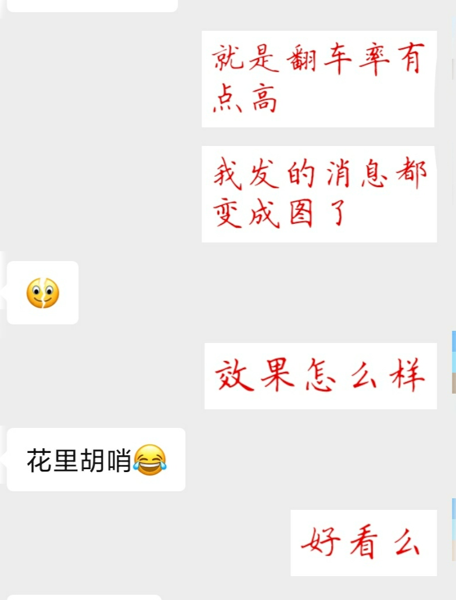

# TextToImage

微信聊天文字转图片

## 用法

1. 打开悬浮窗权限、外部存储读写权限，开启辅助服务
2. 微信聊天框输入文字
3. 点击悬浮按钮转换为图片
4. 确认发送
5. goto 2.

## 原理

1. 点击悬浮按钮后，通过 AccessibilityService 获取微信聊天框中文字
2. 将文字转换为图片，保存到磁盘
3. 文件路径保存到剪切版，利用 AccessibilityService 粘贴到微信聊天框
4. 微信聊天框中出现文件路径，弹出是否发送对话框（微信的机制）

## 待解决

- [ ] 发送 GIF 时，接收方显示“下载”按钮
- [ ] Service 中动态申请外部存储写权限
- [ ] 文字排版：目前限制每行字符数，过于粗暴 
- [ ] 自定义字体、颜色
- [ ] 预览

## 致谢

- [AccessibilityUtil](https://github.com/xuyisheng/AccessibilityUtil)
- [android-gif-encoder](https://github.com/nbadal/android-gif-encoder)
